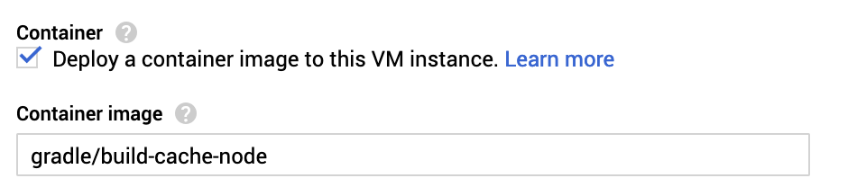
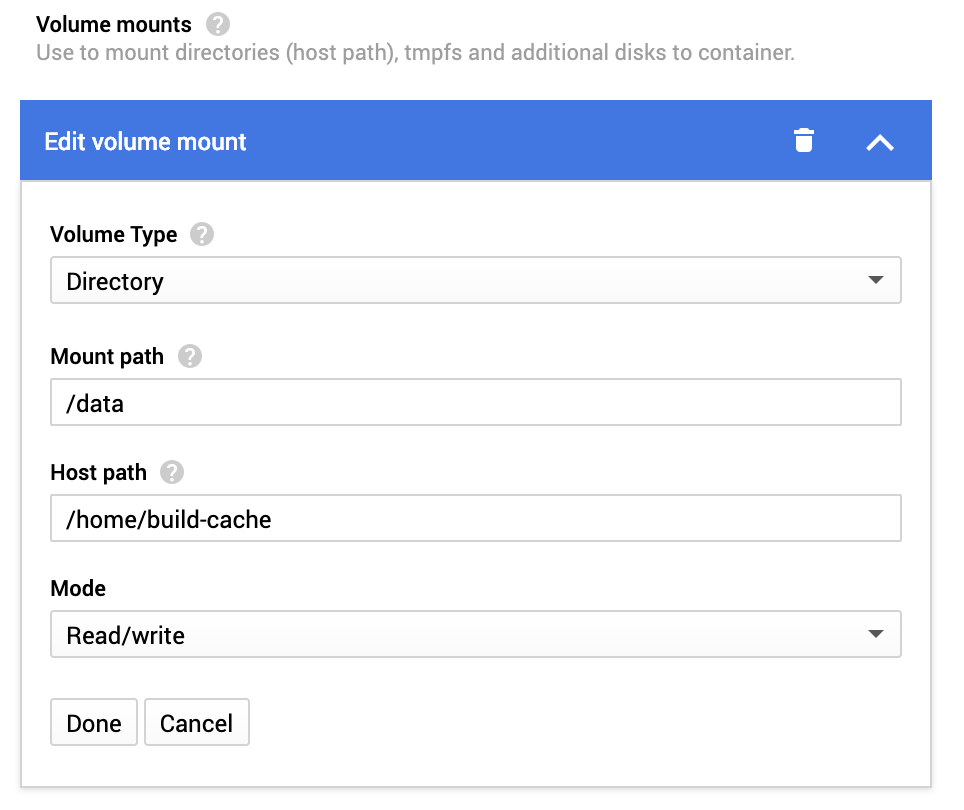
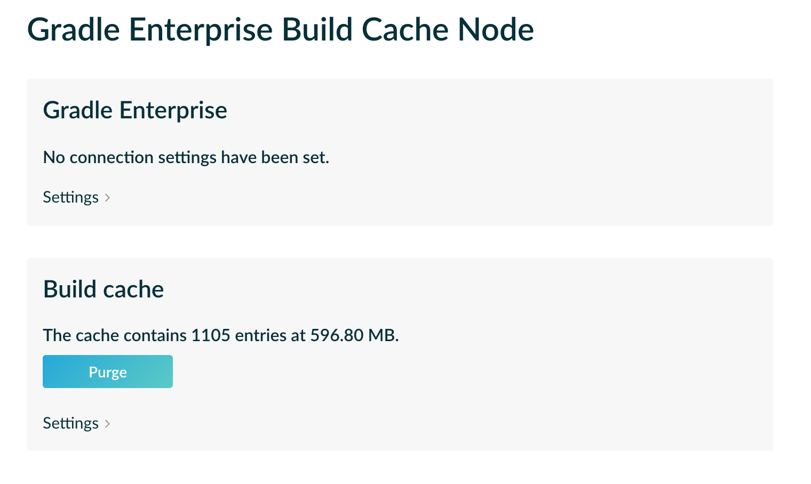
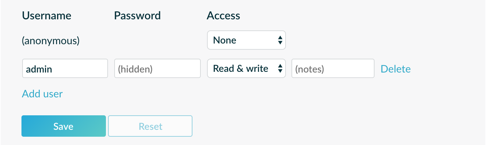
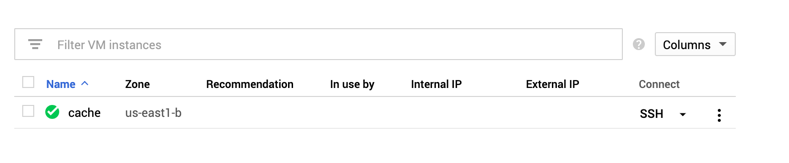

Gradle's [build cache](https://guides.gradle.org/using-build-cache/) is a great way to speed up builds and if you're not already using this locally, you should be!

But what about CI builds? I was recently trying to fix some slow CI builds and the biggest problem was that nothing was cached. Each build was essentially a clean build and the entire project was being from scratch, even if there was only a small change.

The good news is Gradle's build cache is not just limited to a local cache - it supports remote caches as well!

### Remote build cache

Remote build caches are not Gradle specific - they're just http build caches. If you're at a large organisation you may already have something like [JFrog Artifactory](https://jfrog.com/artifactory/) that can be setup as a build cache.

But what if you don't? Well, Gradle's got you covered there too with a [build cache node](https://docs.gradle.com/build-cache-node/) available as a Docker image. 

You could host this image in a number of ways, but in this post I'm going to walk you through **setting up a build cache node on Google Compute Engine, for free!**

Just interested in Gradle remote build caches? There's a great article about them [here](https://medium.com/@cesarmcferreira/using-gradle-build-cache-server-73d7680baf2a)

### Google Compute Engine

Google Compute Engine let's you create and host virtual machines, and even better - you can create a machine and automatically deploy a container image all through the web console. 

No manual configuration required!

The lowest tier virtual machine (f1-micro) is also part of Google Clouds [Always Free Tier](https://cloud.google.com/compute/pricing). Since our build cache won't be CPU intensive this will probably do the job.

### Creating the VM

Create a new project in Google Cloud and navigate to *Compute Engine -> VM Instances -> Create Instance*.


Give it a name, and choose a region, and set the machine type.
*Note: only some regions qualify for the [free tier](https://cloud.google.com/compute/pricing)*

Enable 'Deploy a container image to this VM instance' and in the 'Container Image' field, paste in 'gradle/build-cache-node'.

Our virtual machine will now automatically run this image on boot. Awesome 👍.



We also need to setup a disk volume for our build cache to use.

Expand 'Advanced container options' and click 'Add Volume'

Configure as follows:



And that's it! Click create and wait for your fresh new VM to spin up.

Oh and one last thing - under VPC Network -> Firewall Rules add 2 new rules to allow http traffic in and out of port 5071. This is the default port for Gradle Build Cache Node.

### Configuring Gradle Build Cache Node

If everything goes according to plan you'll now have a Google Compute Engine VM running Gradle Build Cache Node.

You can access it at http://xx.xxx.xx.xx:5071/.



You can start using this right away, but by default it will be open to everyone. Let's lock it down. 🔒

Expand Build Cache -> Settings and disable anonymous access and add a new user:



Hit save, and our new will be added. This user restricts access to the build cache, but the UI is still open for all to see.

Let's add an admin user for UI access. This can only be done by editing the **config.yaml** file directly.

In Compute Engine -> VM Instances, click SSH next to your virtual machine.



Navigate to `/home/build-cache/conf` and edit the config.yaml file.

We need to add a new section add the start of the file (order matters!) to configure UI access:

```
version: 2
uiAccess:
  username: "admin"
  password:
     hash: ""
     salt: ""
     algorithm: "sha256"
```

If you're keeping the same user details as the user we configured via the UI, you should be able to copy the hash/salt from further down the config.yaml file.

If not, Gradle has instructions on how to generate a new hash/salt [here](https://docs.gradle.com/build-cache-node/#generating_password_hashes). 

###Wow that was easy! 🎉

That's it, we're done. You've now setup your very own remote build cache node. I'll leave the Gradle configuration up to you.

Check out [this great article about it](https://medium.com/@cesarmcferreira/using-gradle-build-cache-server-73d7680baf2a).


If you liked this article, make sure to ❤ it below, and follow me [on twitter](https://goo.gl/OgwlgJ)!